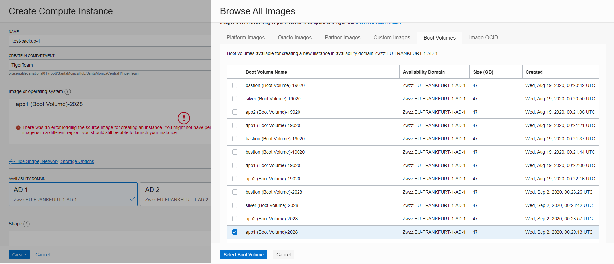
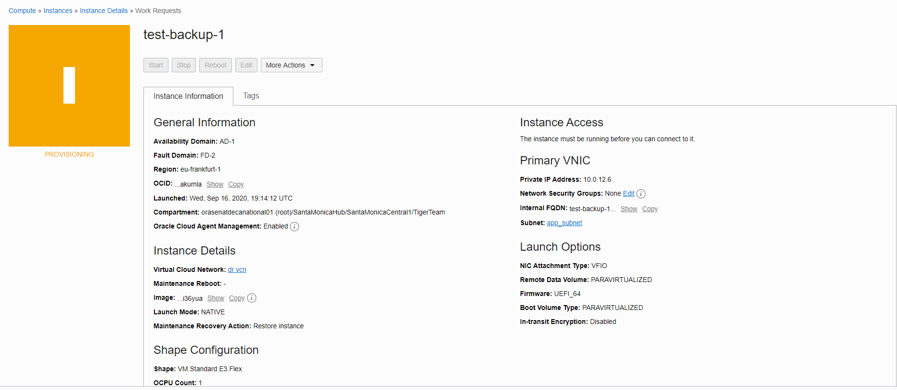
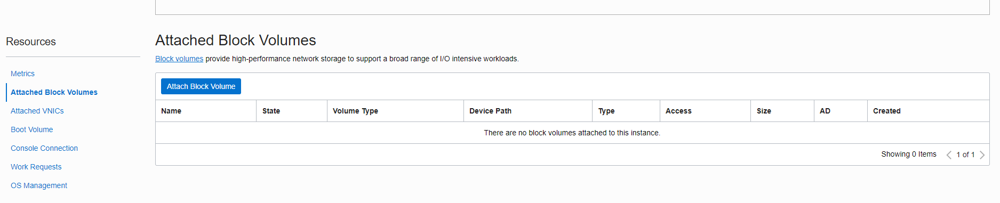
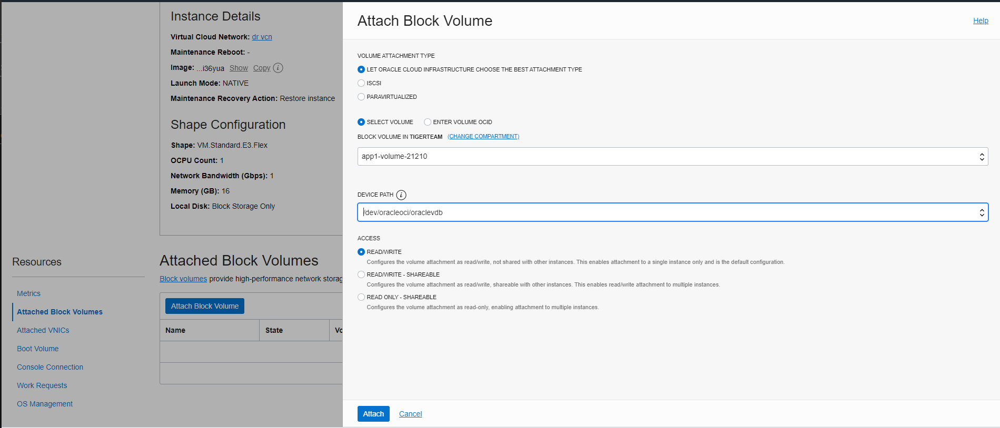
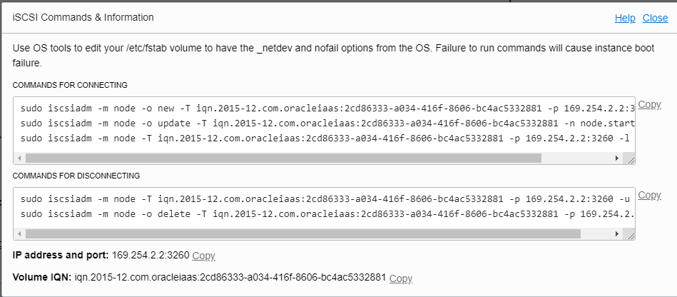
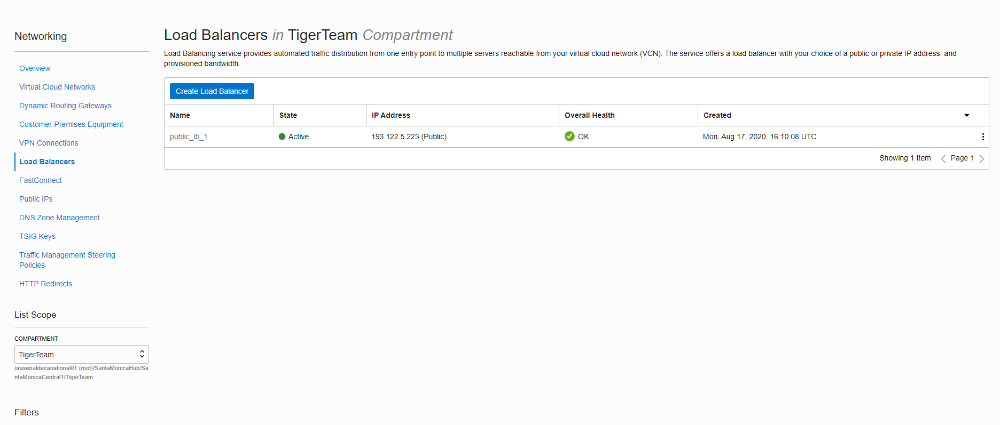
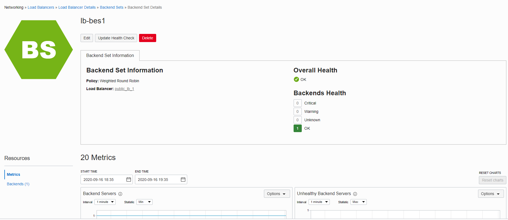
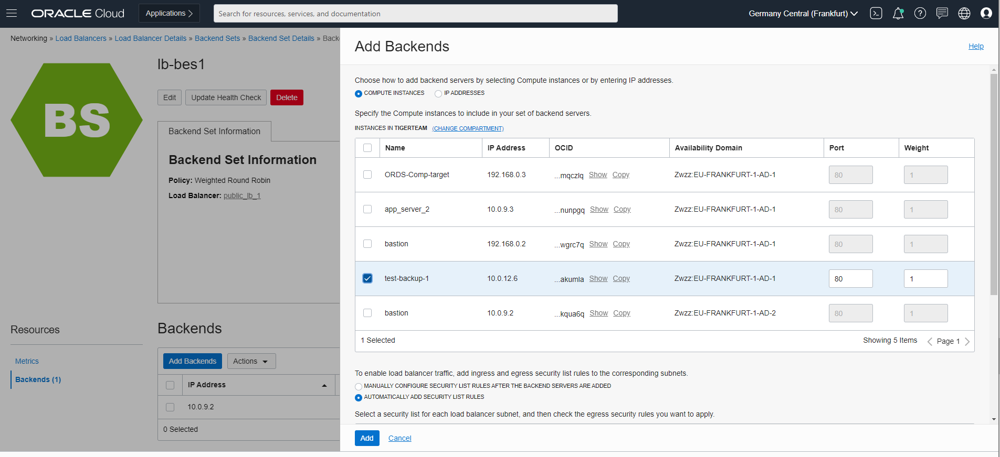

# Lab 200: Disaster Recovery - Part 2: Automation & Traffic Steering

<!-- Comment out table of contents
## Table of Contents
[Introduction](#introduction)
-->


## Introduction

This lab walks your through how to automate your block and boot volumes backups to a new region. Should disaster strike your primary region, it is critical to have the backups elsewhere. Then you will configure the Traffic Management policy - in the event that your servers in the primary region are down, your DNS entry will re-route visitors to your servers in your DR region.

### Objectives
- Configure DNS failover to DR region in traffic management
- Run attached Python scripts to take backups and move them from primary to standby region

### Required Artifacts
    -   Included Python scripts
        - block-volume-migration.py
        - boot-volume-migration.py
        - located: 
        ```
        .
    └── pilot-light
        ├── README.md
        ├── assets
        │   ├── scripts
        │   │   ├── README.md
        │   │   ├── block-volume-migration.py
        │   │   ├── boot-volume-migration.py

    
    -   Configure OCI SDK
    -   Relevant IAM permissions in your tenancy to manage [DNS](https://docs.cloud.oracle.com/en-us/iaas/Content/Identity/Reference/dnspolicyreference.htm) & [block volumes](https://docs.cloud.oracle.com/en-us/iaas/Content/Identity/Reference/corepolicyreference.htm#Details_for_the_Core_Services)

### Extra Resources

- [DNS traffic management](https://docs.cloud.oracle.com/en-us/iaas/Content/EdgeServices/overview.htm)
- [Installing the OCI Python SDK](https://oracle-cloud-infrastructure-python-sdk.readthedocs.io/en/latest/installation.html)
- [Creating Volume Backups](https://docs.cloud.oracle.com/en-us/iaas/Content/Block/Concepts/blockvolumebackups.htm)
- [Copying Volume Backups](https://docs.cloud.oracle.com/en-us/iaas/Content/Block/Tasks/copyingvolumebackupcrossregion.htm)
- [Restoring Volume backups](https://docs.cloud.oracle.com/en-us/iaas/Content/Block/Tasks/restoringavolumefromabackup.htm)
- [File Storage](https://docs.cloud.oracle.com/en-us/iaas/Content/File/Concepts/filestorageoverview.htm)
- [Active Data Guard](https://www.oracle.com/database/technologies/high-availability/dataguard.html)

## Part 1. DNS traffic steering


From the OCI console, under networking go to the traffic steering policies.


Create a failover traffic steering policy.


This policy will point your DNS to your standby region's load balancer if your primary region's load balancer fails the health check. 


You can get your load balancer IPs from Netowrking -> Load balancers. Make sure you are in the correct regions. 


You can see, we switch regions on the upper right to get the IP of the LB in the standby region, Frankfurt.


Input the information like above. 

Make sure to attach the health check to your primary region's load balancer, this is what determines if traffic should be re-directed to your standby region. 


This is a summary of your traffic steering policy.

### Attach a subdomain to the DNS zone
1.

2.

3.Publish to finish attaching.


## Part 2. Block & boot volume backup automation with Python

### **STEP 0**: What do the scripts do

1.   Boot Volume script (boot-volume-migration.py) takes all volume from one region for a given compartment and restores this volume across any given region thru volume backups

        usage: boot-volume-migration.py [-h] 
                    --compartment-id COMPARTMENT_ID
        
                    --destination-region DESTINATION_REGION
        
                    --availability-domain AVAILABILITY_DOMAIN

2. Block Volume script (block-volume-migration.py) takes all volume from one region for a given compartment and restores this volume across any given region thru volume backups

        usage: block-volume-migration.py [-h] 
                     --compartment-id COMPARTMENT_ID
        
                     --destination-region DESTINATION_REGION
        
                     --availability-domain AVAILABILITY_DOMAIN

Steps in the automation scripts:

1. create_volume_backups in source region
2. copy_volume_backups across destination region
3. restore_volume in destination region

## Run the scripts manually ##

### **STEP 1**: Run the scripts

Below is the command to run each script.
```
python block-volume-migration.py --compartment-id ocid1.compartment.oc1..123 --destination-region eu-frankfurt-1 --availability-domain AD-2
```

```
python boot-volume-migration.py --compartment-id ocid1.compartment.oc1..aaaaanq --destination-region eu-frankfurt-1 --availability-domain AD-2
```

Below you can see the volume backups now created in your source region, our's is London.


And in your DR region, you should be able to see the backups there as well from your specified source region.


## Verify the backups were generated ##

The terraform script configures a cron job on bastion server to run the python scripts which copies boot/block volumes and restores them across to DR region (default schedule is set for 12 hours).

**The previous manual step of running the scripts yourself means you do not have to reconfigure the scheduler with the instructions below to proceed in this lab.** 

Navigate to OCI Console and verify that both boot volumes and block volumes are copied to DR region, in this case Frankfurt. You can tweak the cron scheduler on bastion server of Primary region using "crontab -e" for testing purposes or as needed.

### Attach copied volumes to DR region compute ###

On the OCI console, change to your specified DR region. Create a new compute instance in the app_subnet.

1. Click "change image" and select boot volume.
There select the restore boot volume copied over from the volume backup from the source region, London.
    
    
2. Submit the instance to be created. 
    

3. SSH into the newly created instance.

    You can verify that the site is working with `curl http://localhost`.
    
        [root@test-backup-1 html]# curl http://localhost
        <html>
        <html>
        <body>
        <h1>This is your primary region.</h1>
        <p>Located in Londan. App server 1</p>
        
        </body>
        </html>
        </body>
        </html>
        
        [root@test-backup-1 html]#

4. *Follow the instructions in the [html file](HTML-Instructions.txt) to update the http for the secondary instance.*

5. This confirms that boot volume DR scenario is working as expected. Go to this directory with 'cd /etc/fstab', comment out the last line of UUID mapping, and save the file. 
Naviate to 'Attached Block Volumes" on OCI Console -> Compute -> select the compute you just created. 

    Click attach block volume and select the restored block volume copied over through volume backup from source region, London.
    
    
    Select the device path "/dev/oracleoci/oraclevdb".
    
    
    
    
        [opc@test-backup-1 html]# sudo iscsiadm -m node -o new -T iqn.2015-12.com.oracleiaas:2cd86333-a034-416f-8606-bc4ac5332881 -p 169.254.2.2:3260
        New iSCSI node [tcp:[hw=,ip=,net_if=,iscsi_if=default] 169.254.2.2,3260,-1 iqn.2015-12.com.oracleiaas:2cd86333-a034-416f-8606-bc4ac5332881] added
        [opc@test-backup-1 html]# sudo iscsiadm -m node -o update -T iqn.2015-12.com.oracleiaas:2cd86333-a034-416f-8606-bc4ac5332881 -n node.startup -v automatic
        [opc@test-backup-1 html]# sudo iscsiadm -m node -T iqn.2015-12.com.oracleiaas:2cd86333-a034-416f-8606-bc4ac5332881 -p 169.254.2.2:3260 -l
        Logging in to [iface: default, target: iqn.2015-12.com.oracleiaas:2cd86333-a034-416f-8606-bc4ac5332881, portal: 169.254.2.2,3260] (multiple)
        Login to [iface: default, target: iqn.2015-12.com.oracleiaas:2cd86333-a034-416f-8606-bc4ac5332881, portal: 169.254.2.2,3260] successful.
        [opc@test-backup-1 html]# lsblk -f
        NAME   FSTYPE LABEL UUID                                 MOUNTPOINT
        sdb
        └─sdb1 xfs          49cc1ddd-b390-4fbc-99a5-1cda89c0d8ef
        sda
        ├─sda2 swap         bf8f71d6-5bae-4981-8eae-2171e78524d6 [SWAP]
        ├─sda3 xfs          553c3110-8f96-454c-9399-3c5c18f3d631 /
        └─sda1 vfat         38DB-ABB6                            /boot/efi
    
    Finish the volume attachment.

6. Navigate to the backend set of the public load balancer add the newly created compute to the backend set.

    
    
    
    
    

Verify the application is working as expected in the Frankfurt DR region by navigating to the load balancer url.


## Part 3. Object Storage Replication

The terraform script will also configure object storage bucket replication across your regions. 

Navigate to OCI Console in your primary region to the object storage bucket and upload one or more files.

Navigate to OCI Console in your DR region to the bucket and verify that the files uploaded in primary region show up.

Now delete the files in your primary region's bucket and verify the files are deleted in your DR region.

## Part 4. File Storage Replication

The terraform script will also configure rsync between the file storage systems across the regions. 

A CRON job is setup in primary region on the APP-server-1 compute to take snapshot every hour and another CRON job is setup in DR region's replication compute server to do a rsync across region every 30 mins.

SSH into APP-server-1 compute through the bastion host and drop a file at location '/home/opc/src_filestore/' .

Verify the snapshot through OCI console in File Storage/File Systems screen.

Verify the file gets replicated to the standby region's FSS.

SSH into private server IP of the replication_compute server, and navigate to '/home/opc/dst_filestore' and verify the file exists there.

## Part 5. Database Replication

The terraform script also configures active dataguard between the databases in both regions.

Validation can be done by doing DDL/DML transactions on database in the primary region and then checking that these transactions are replicated to the database in the DR region.

## Summary

-   In this lab, you used the OCI Python SDK to automate your block volume backups to another region, and then restore them. You configured your DNS to route to your DR region in the event of a disaster in your primary region. In the next lab, we will be simulating a disaster. You also have working rsync between your object storage buckets and file storage systems between your primary and DR regions. Lastly, the databases in your regions are now connected with Active Data Guard, but you can see how to manually configure that [here].

-   **You are ready to move on to the next lab!**

[Back to top](#introduction)

